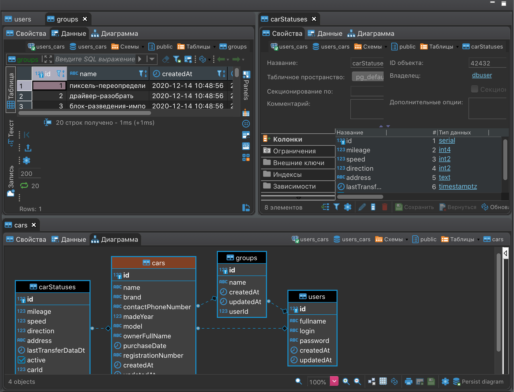
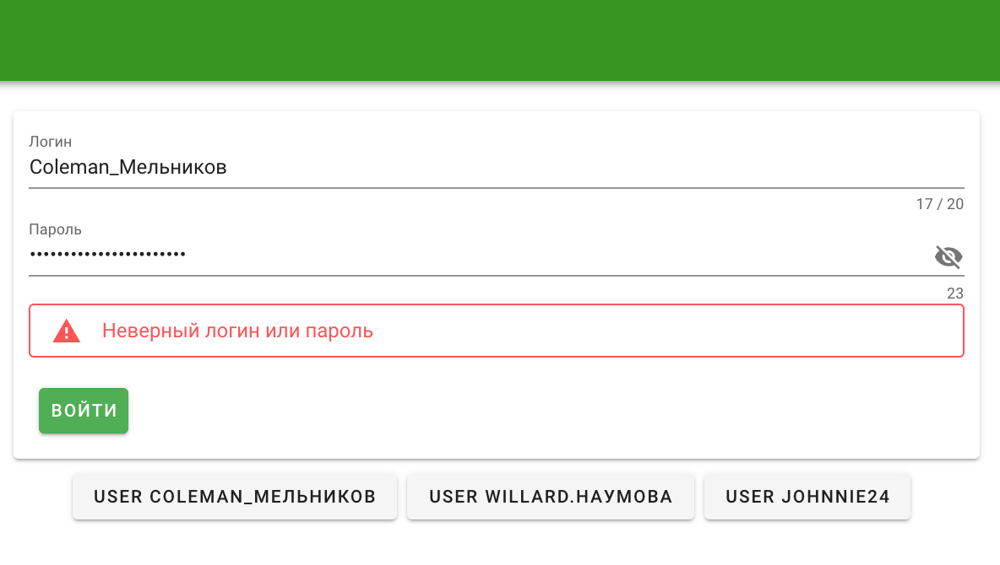
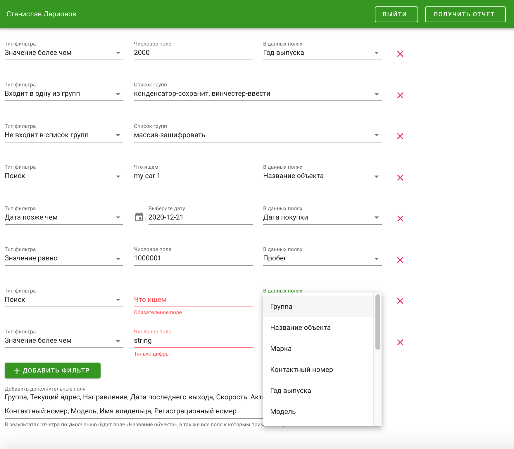
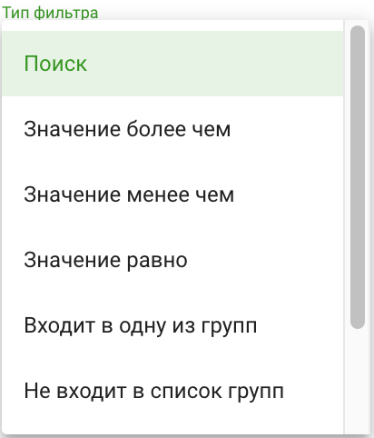
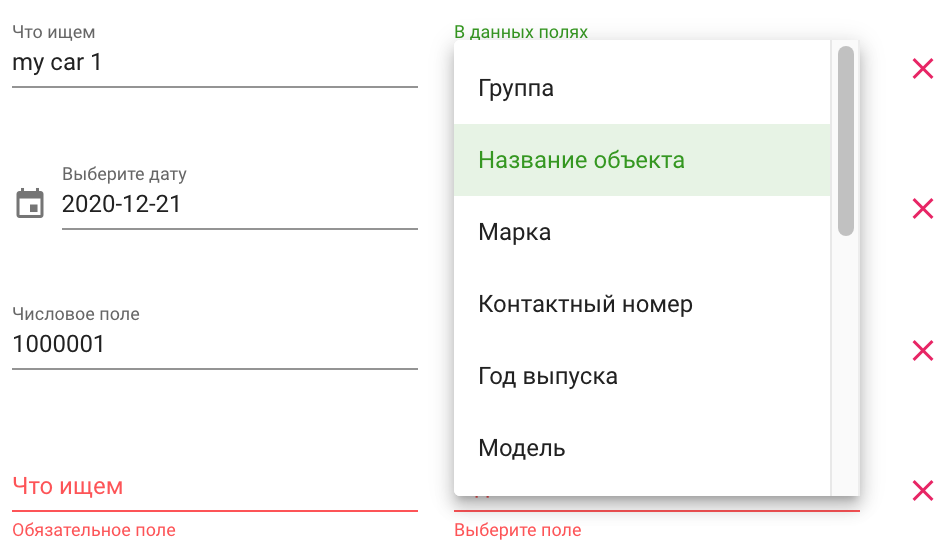
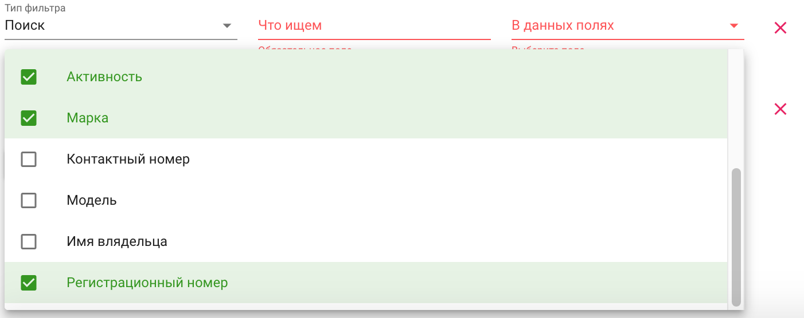
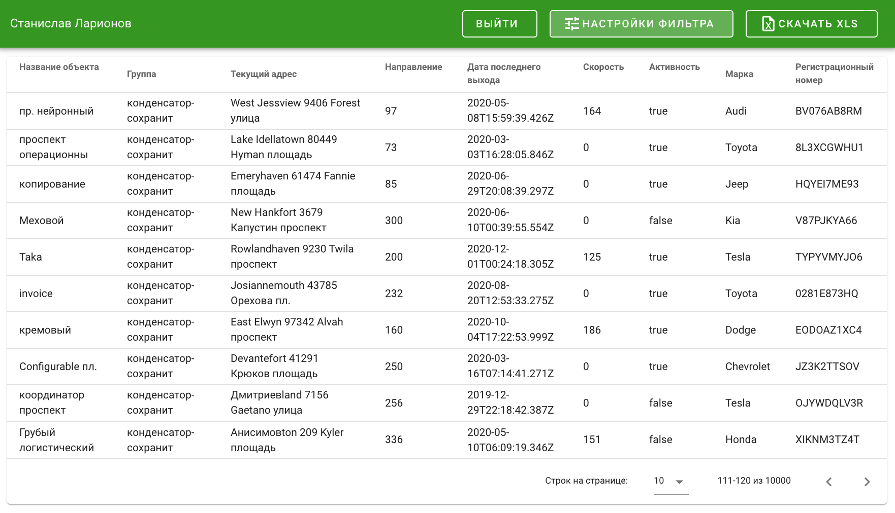
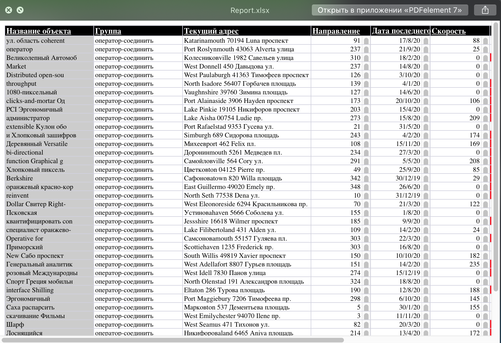

# Report service
Add ``.env`` files to client and server directories following the example from the ``.env.example`` files

``HTTPS_LOCALHOST_CRT`` and ``HTTPS_LOCALHOST_KEY`` - not necessary

Set ``IS_UPDATE_FAKE_DATA=1`` if you want to reset the database and push new generated fake data.

```
cd server
npm i
npm start
```

```
cd client
npm i
npm run serve
```
### Authorization

### Filter Rules




### Render report on vue

### Downloaded xlsx report file
